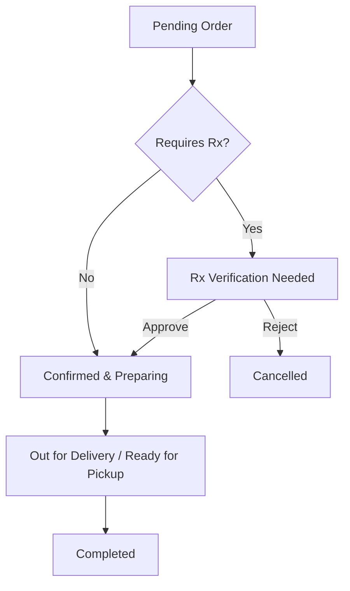

# Standard Operating Procedure (SOP)
## Pharmacy Smart Pharmacy Management System

This document is the Standard Operating Procedure (SOP) for the pharmacy staff. Keep this document printed or bookmarked at the main billing counter for quick reference.

---

## 1. Access & Authentication

### 1.1 Logging In
1. Open your web browser and navigate to the Staff Portal URL (e.g. `https://yourdomain.com/staff/login` or click **Staff Portal** on the main page).
2. Enter your registered **10-digit Phone Number** and **Password**.
3. Click **Sign In**.

### 1.2 Troubleshooting Login Issues
- Double-check that your phone number is correct and has no spaces.
- If you forget your password, contact the **System Administrator** to reset it.
- **Security Rule**: Never share your login credentials with other staff members. Every action on the system is logged under the active staff account for audit trails.

---

## 2. Order Management

All customer orders appear in the **Orders Queue** under the **Orders** tab on your staff dashboard.

### 2.1 Processing a New Order
1. Navigate to the **Orders** tab to view pending orders.
2. Click on the order ID (e.g. `#101`) to open the **Order Details** screen.
3. Review the order items, delivery type (**Home Delivery** or **Store Pickup**), and payment method (**COD** or **Online Paid**).

### 2.2 Prescription (Rx) Verification Protocol
If an order contains prescription-only medicines, it will show a **Prescription Required** badge and remain locked in the status `rx_pending`.

**Verification Procedure:**
1. Under the **Prescriptions** card on the right-hand side, click on the uploaded prescription image/file to open it.
2. **Mandatory Auditing Checks**:
   - **Legibility**: Can you clearly read the doctor's name, patient name, and drug list?
   - **Patient Name**: Does it match the customer's account name?
   - **Validity**: Is the prescription dated within a reasonable timeframe (typically within [CONFIRM WITH PHARMACIST/DRUG LICENSE HOLDER — validity window in days/months])?
   - **Drugs**: Does the prescription list the exact drugs and dosage ordered in this request?
3. **Approval**:
   - If all checks pass, click **Verify & Approve**.
   - The order status will automatically transition to **Confirmed**, and inventory counts will automatically decrement.
4. **Rejection**:
   - If the upload is invalid (e.g., blurry image, wrong name, expired, or missing drugs), click **Reject Prescription**.
   - Select or write a clear, friendly **Rejection Reason** (e.g., *"Uploaded prescription is blurry. Please upload a clear photo of the original prescription."*).
   - This marks the order as **Cancelled** and instantly alerts the customer.

---

## 3. Inventory & Stock Management

Maintaining accurate stock levels is critical to prevent stockouts and order delays.

### 3.1 Monitoring Stock Levels
- Go to the **Products** section in the sidebar.
- Look out for product cards marked with a yellow **Low Stock Alert** badge (this alert fires when a product falls below its designated warning threshold, default is 10 units).

### 3.2 Restocking an Item
1. Locate the product in the **Products** listing.
2. Click on the product name to open the product details.
3. Click the **Restock Product** button.
4. Enter the quantity of stock received from the distributor.
5. Click **Confirm Restock**. The inventory log will automatically record this adjustment.

### 3.3 Adding or Editing a Product
- **Adding**: Click **Add New Product** at the top right of the inventory screen. Enter the Name, Brand, Category, Packaging Unit (e.g., *strip of 10*), Sale Price, MRP, and stock level. Mark **Rx Required** if it is a prescription drug.
- **Editing**: Click **Edit Product** on an existing item's detail page to modify its price, active status, image, or low-stock warning threshold.

---

## 4. Operational Escalation Path

If you encounter technical issues or errors on the system:

1. **Database / Connection Error**: Ensure the store internet connection is active. Refresh the page.
2. **Payment Inconsistencies**: If a customer claims they paid online via Razorpay but the order remains `unpaid` in the system, check the **Razorpay Dashboard** using the transaction ID.
3. **Severe System Outages**: Contact the Technical Lead immediately:
   - **Tech Support Email**: `support@yourdomain.com` (or your personal support contact)
   - **Critical Incidents logs**: Viewable via Sentry dashboard.
